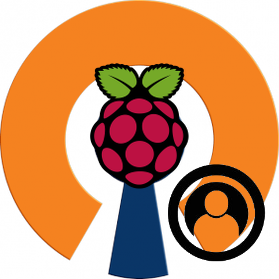

<!--
*** Thanks for checking out this README Template. If you have a suggestion that would
*** make this better, please fork the repo and create a pull request or simply open
*** an issue with the tag "enhancement".
*** Thanks again! Now go create something AMAZING! :D
-->

<!-- PROJECT SHIELDS -->
<!--
*** I'm using markdown "reference style" links for readability.
*** Reference links are enclosed in brackets [ ] instead of parentheses ( ).
*** See the bottom of this document for the declaration of the reference variables
*** for contributors-url, forks-url, etc. This is an optional, concise syntax you may use.
*** https://www.markdownguide.org/basic-syntax/#reference-style-links
-->
<!-- PROJECT LOGO -->
<br />
<p align="center">
  <a href="https://github.com/vleeuwenmenno/SSH-Monitor">
    
  </a>

  <h3 align="center">SSH Monitor for PiVPN</h3>

  <p align="center">
    A SSH Monitor with user management that works with PiVPN
    <br />
    <br />
    <a href="https://github.com/vleeuwenmenno/SSH-Monitor/releases">Download</a>
    ·
    <a href="https://github.com/vleeuwenmenno/SSH-Monitor/issues">Report Bug</a>
    ·
    <a href="https://github.com/vleeuwenmenno/SSH-Monitor/issues">Request Feature</a>
  </p>
</p>


<!-- ABOUT THE PROJECT -->
## About The Project

I was searching for a very simple manager to manage all my Pi VPNs as I am running quite a few of them. This app allows you to manage users of PiVPN without using the terminal.

<!-- CONTRIBUTING -->
## Contributing

Contributions are what make the open source community such an amazing place to be learn, inspire, and create. Any contributions you make are **greatly appreciated**.

1. Fork the Project
2. Create your Feature Branch (`git checkout -b feature/AmazingFeature`)
3. Commit your Changes (`git commit -m 'Add some AmazingFeature'`)
4. Push to the Branch (`git push origin feature/AmazingFeature`)
5. Open a Pull Request


<!-- LICENSE -->
## License

```
            DO WHAT THE FUCK YOU WANT TO PUBLIC LICENSE
                    Version 2, December 2004

 Copyright (C) 2004 Sam Hocevar <sam@hocevar.net>

 Everyone is permitted to copy and distribute verbatim or modified
 copies of this license document, and changing it is allowed as long
 as the name is changed.

            DO WHAT THE FUCK YOU WANT TO PUBLIC LICENSE
   TERMS AND CONDITIONS FOR COPYING, DISTRIBUTION AND MODIFICATION

  0. You just DO WHAT THE FUCK YOU WANT TO.
```

<!-- CONTACT -->
## Contact

Menno van Leeuwen - menno@vleeuwen.me - [menno.vleeuwen.me](https://menno.vleeuwen.me)
Project Link: [https://github.com/vleeuwenmenno/SSH-Monitor](https://github.com/vleeuwenmenno/SSH-Monitor)
